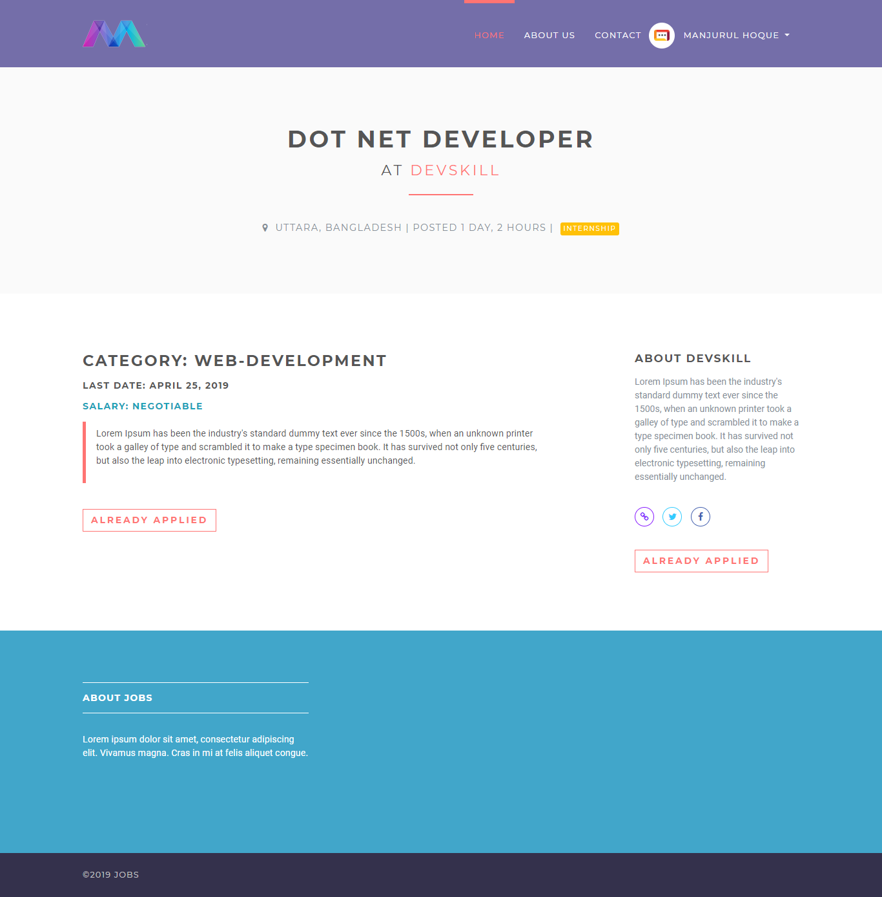

# Django Job Portal

**Django Job Portal** is an open-source web application designed to help job seekers find opportunities and employers post job listings. Built with Django, one of the most powerful web frameworks, and utilizing SQLite as the database, this platform serves as a simple yet effective tool for job search and recruitment management.

The project is aimed at providing a user-friendly interface for both job seekers and employers. Job seekers can easily browse job listings, filter by categories, and apply for positions, while employers can post job vacancies, manage their listings, and review applicants. Whether you're a developer looking for a full-stack opportunity or a company needing to find the right talent, this platform simplifies the entire process.

## Key Features
- **User Registration and Authentication**: Both job seekers and employers can create an account, log in, and manage their profiles.
- **Job Search Functionality**: Job seekers can search for jobs based on various criteria, such as job title, location, and salary range.
- **Job Posting (For Employers)**: Employers can post new job listings with a detailed description, qualifications, and application process.
- **Job Application**: Job seekers can apply to jobs with a simple click, submitting their resumes and cover letters through the platform.
- **Dashboard (For Employers and Job Seekers)**: A personalized dashboard for both job seekers and employers to view their activity, manage applications, and track job listings.
- **Responsive Design**: The platform is designed to work seamlessly across desktops, tablets, and mobile devices.
- **Admin Panel**: The built-in Django admin panel allows the site administrator to manage users, job listings, applications, and other essential data.

## Live Demo
Explore the live demo of the platform to see how it works. The demo showcases the full functionality of the system, including job posting, job searching, and the user dashboard. You can view the demo [here](#).

## Tech Stack
- **Django**: A high-level Python web framework that promotes rapid development and clean, pragmatic design. Django simplifies many aspects of web development, such as database management, authentication, and user management, making it an ideal choice for building scalable web applications.
- **SQLite**: A lightweight, serverless database engine. SQLite is easy to set up and use, making it a good fit for small to medium-sized applications. For larger applications, it can be easily replaced with more robust database systems such as PostgreSQL or MySQL.
- **Bootstrap**: A popular front-end framework for developing responsive and mobile-first websites. Bootstrap is used for designing the UI elements and ensuring the platform looks great on all devices.
- **HTML5, CSS3, JavaScript**: The core technologies for structuring the pages, styling the UI, and adding interactivity to the site.

## Installation Instructions
To set up the Django Job Portal on your local machine, follow these steps:

1. **Clone the repository**:
    ```bash
    git clone https://github.com/mederhoo-script/alx_job_seek.git
    ```

2. **Create a virtual environment**:
    ```bash
    python3 -m venv venv
    source venv/bin/activate  # On Windows, use venv\Scripts\activate
    ```

3. **Install the dependencies**:
    ```bash
    pip install -r requirements.txt
    ```

4. **Apply the migrations**:
    ```bash
    python manage.py migrate
    ```

5. **Create a superuser (optional)**:
    ```bash
    python manage.py createsuperuser
    ```

6. **Run the development server**:
    ```bash
    python manage.py runserver
    ```

Visit `http://127.0.0.1:8000/` in your browser to view the application.

## Screenshots
Here are some of the key pages and features available on the platform:

- **Home Page**: The homepage displays featured job listings, categories, and quick links to search for jobs or post a job.
  

- **Job Search Results**: This page shows the results of job search queries with filtering options for job seekers to refine their search.
  

- **Add New Job (Employer)**: Employers can create a new job listing by filling out a simple form with job details like job title, description, and requirements.
  

- **Job Details**: The job details page displays a comprehensive job description, requirements, and application instructions.
  

- **Job Seeker Dashboard**: Job seekers can view their applied jobs, track status, and update their profiles.
  

## Contribution Guidelines
Contributions are welcome! Whether you're fixing bugs, improving documentation, or adding new features, your help is appreciated. Please follow the steps below to contribute:

1. Fork the repository.
2. Create a new branch for your feature or bug fix.
3. Make your changes and commit them.
4. Push to your forked repository.
5. Create a pull request with a clear description of your changes.

## License
This project is licensed under the MIT License - see the [LICENSE](LICENSE) file for details.

## Show Your Support
If you find this project useful, please consider starring ⭐ this repository to show your support. Your feedback and contributions are what keep this project alive and help improve the platform for everyone.
